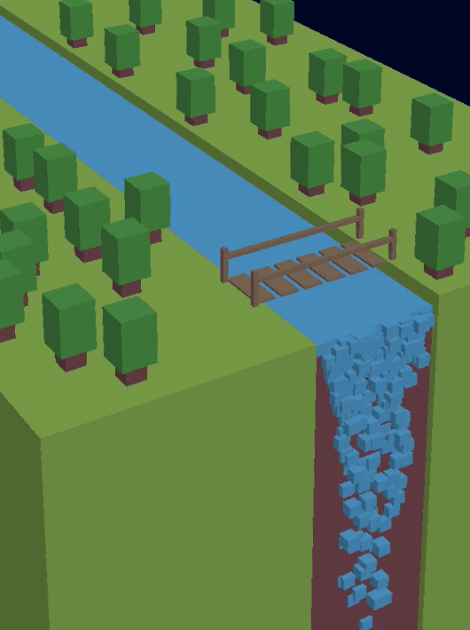
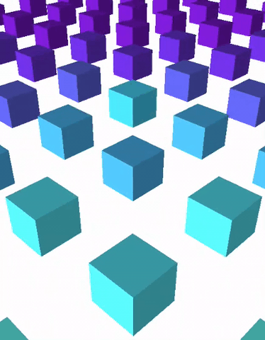

# Museo Temporal
TC3022 Computer Graphics Final Project.

Museo creado con la librería ThreeJS que demuestra una exposición de figuras y cuadros interactivos.

# Objetivo general

El objetivo de este proyecto es realizar un Museo Temporal usando Javascript, HTML y Threejs como nuestras herramientas principales. Se busca poner en practica nuestras habilidades usando diversas librerias de Threejs de manera optima y dando como resultado un proyecto exitoso y sin errores.

Se busca crear un museo temporal interactivo que le permita al usuario explorar diferentes objetos de arquitecturas peculiares que solo podrian ser mostrados de forma virtual ya que muchos de estos objetos no podrían existir realmente por sus caracteristicas fisicas. Buscamos brindar una experiencia de aprendizaje al usuario pero que al mismo tiempo pueda divertirse desplazándose a través del museo y conociendo nuevas figuras de arte de manera virtual.

En cuanto a las obras, esculturas, cuadros, etc que son el atractivo principal del proyecto se tiene planeado que estas sean objetos con diseños extravagantes ya sean figuras imposibles, arte abstracto, surrealismo, arte digital, entre otras. Este arte que haremos por medio de 3js además del diseño complejo que puedan llegar a tener algunas usarán animaciones para hacer un proyecto donde apliquemos la mayoría de conceptos aprendidos en la clase.
Las propuesta de arte que tenemos son las siguientes.

# 🚀 Como correrlo
El proyecto se puede visualizar con la extension de VScode [Live Server](https://marketplace.visualstudio.com/items?itemName=ritwickdey.LiveServer).
``` ssh
git clone git@github.com:saulmontesdeoca/museotemporal.git
cd museotemporal
```

# 🎨 Cuadros
Todos los cuadros utilizan Render targets, lo cual es basicamente un metodo para renderear una escena sobre una textura:
- Se tiene que instanciar, para crear un cuadro, una escena y camara propia y por supuesto un render target:

```javascript
    // render target
    let renderTarget = new THREE.WebGLRenderTarget(rtWidth, rtHeight);
    // frame Camera
    let frameCamera = new THREE.PerspectiveCamera( fieldOfView, aspectRatio, nearPlane, farPlane);
    // frame scene
    let frameScene = new THREE.Scene();
```

- Esto se hace porque para después poder renderear sobre la textura se tienen que hacer los siguientes metodos en run():

```javascript
    renderer.setRenderTarget(renderTarget);
    renderer.render(frameCamera, frameScene);
    renderer.setRenderTarget(null);
```

- Así es como se debe de crear el Mesh del frame, pasandole como textura el render target:

```javascript
    const geometry = new THREE.PlaneGeometry( xSize, ySize, 32 );
    
    const material = new THREE.MeshPhongMaterial({
        map: riverRenderTarget.texture,
        side: THREE.DoubleSide
    });
    let frame = new THREE.Mesh(geometry, material);
```

- Cada cuadro cuenta con musica/efectos de sonido, al crear cada cuadro se utiliza PositionalAudio y se agrega al mesh especifico del cuadro.
Se tiene que definir un AudioListener y se tiene que agregar a la camara de la escene del museo. Tambien se tiene que crear un array global que contendra todos los audios cargados en la escena. Esto es para que cada vez que el usuario desbloqueé el pointer lock la musica pare. Se logra con unos simple if statements en el metodo run(). El metodo de posicionamiento de audio en los cuadros funciona de la siguiente manera: 

```javascript
    const listener = new THREE.AudioListener();
    camera.add( listener ); // agregando audio a la camara de la escena del museo
    let sound = new THREE.PositionalAudio( listener );
    const audioLoader = new THREE.AudioLoader();
    audioLoader.load( songRoute, function( buffer ) {
        sound.setBuffer( buffer );
        sound.setRefDistance( .2 );
        sound.setLoop(true);
        sound.setVolume(volume);
        sound.play();
    }); 

    sounds.push( sound ); // agregando sonido al array global utilizado en run()
    
    meshDelCuadro.add( sound );

```

## Waterfall frame
<div align="center">
    
</div>
Para la creación de este cuadro se utilizaron los siguientes metodos:
- Pasto, se utilixaron dos boxGeometries, una para cada lado del río:

```javascript
    // grassland 
    let geometry_left = new THREE.BoxGeometry( x, y, z ); // definiendo la geomteria
    let material_grass = new THREE.MeshLambertMaterial( { color: Colors.greenLight } ); // definiendo el material para el pasto y su color
    let ground_left = new THREE.Mesh( geometry_left, material_grass );
    ground_left.position.set(-1,-1.33,-1.64);
    riverFrameScene.add( ground_left );

    //grassland right
    let geometry_right = new THREE.BoxGeometry( x, y, z ); // definiendo la geomteria debe ser un poco mas larga por el angulo de la camara
    let ground_right = new THREE.Mesh( geometry_right, material_grass );
    ground_right.position.set(2.3,-1.77,-4);
    riverFrameScene.add( ground_right );
```

- Arboles, se utilizo la siguiente funcion:

```javascript
    let tree=function(x,z){
        this.x=x; // para posicion en la escena 
        this.z=z;
        
        //trunk
        let material_trunk = new THREE.MeshLambertMaterial({ color: Colors.brownDark  }); // definiento material y color
        let geometry_trunk = new THREE.BoxGeometry( .15, .15, .15 ); // definiendo la geometria
        let trunk = new THREE.Mesh( geometry_trunk, material_trunk );
        trunk.position.set(this.x,.275,this.z); // altura es fija
        trunk.castShadow = true;
        trunk.receiveShadow = true;
        riverFrameScene.add( trunk ); // se añaden a la escena del frame, NO la del museo
        
        //leaves
        let geometry_leaves = new THREE.BoxGeometry( .25, .4, .25 );
        let material_leaves = new THREE.MeshLambertMaterial({ color: Colors.green}); // definiento material y color
        let leaves = new THREE.Mesh( geometry_leaves, material_leaves );
        leaves.position.set(this.x,.2+.15+.4/2,this.z);
        leaves.castShadow = true;
        customizeShadow(leaves,.25) // mess, opacity
        riverFrameScene.add( leaves ); // se añaden a la escena del frame, NO la del museo
    }
```

- Para la cascada se creó una clase Drop:

```javascript
class Drop {
    constructor(){
        this.geometry = new THREE.BoxGeometry(.1, .1, .1 ); // tamaño pequeño de los drops
        this.material_river = new THREE.MeshLambertMaterial( { color: 0x6BC6FF} ); // color

        this.drop= new THREE.Mesh( this.geometry, this.material_river );
        this.drop.position.set(Math.random(.1,.9),0.1,1+(Math.random()-.5)*.1); // posicion aleatoria pero dentro de un rango
        riverFrameScene.add( this.drop ); // se añaden a la escena de waterfall
        this.speed=0;
        this.lifespan=(Math.random()*50)+50; // se define de manera aleatoria un periodo de vida, despues se remueven de la escena

        this.update=function(){// funcion que va moviendo a cada drop hacía abajo, pareciendo una cascada
            this.speed+=.0007;
            this.lifespan--;
            this.drop.position.x+=(.5-this.drop.position.x)/100;
            this.drop.position.y-=this.speed;
        }
    }
}
```

- La animacion de la cascada, funciona de la siguiente manera dentro de la funcion run():
```javascript
        // River animation en function run(){ }
        // se utiliza mod para disminuir la cantidad de drops creados en un determinado tiempo
        if(count%2==0){
            for(let i=0;i<5;i++){
                drops.push(new Drop());// se crean nuevos Drops y se añaden al array global
            }
        }
        count++;
        for(let i=0;i<drops.length;i++){
            drops[i].update();// funcion para desplazar los drops hacía abajo en forma de cascada
            if(drops[i].lifespan<0){
                riverFrameScene.remove(riverFrameScene.getObjectById(drops[i].drop.id)); // si la vida de estos drops se acabo se eliminan
                drops.splice(i,1);
            }
        }
```

## Cubes frame
<div align="center">
    
</div>

- La creación de los cubos ocurre en una funcion llamada createCube(), esta se encarga de tambien animarlos con TimelineMax:
```javascript
    const createCube = (x, z, group, colour) => {
        let cubeGeometry = new THREE.BoxGeometry( 100, 100, 100 );
        let cubeMaterial = new THREE.MeshLambertMaterial({color : colour, flatShading: THREE.FlatShading});
        let shape = new THREE.Mesh(cubeGeometry, cubeMaterial);
        shape.castShadow = true;
        shape.receiveShadow = true;
        shape.position.x = x;
        shape.position.z = z;
        
        // TimeLineMax para la animación sencilla
        let tl = new TimelineMax({repeat: -1 ,repeatDelay:0.5});
        tl.to(shape.scale, 0.5, {x: 2, ease: Expo.easeOut});
        tl.to(shape.scale, 0.5, {z: 2, ease: Expo.easeOut});
        tl.to(shape.scale, 1, {y: 2, ease: Elastic.easeOut});
        tl.to(shape.scale, 0.7, {z: 1,x:1,y:1, ease: Expo.easeOut});
        tl.to(shape.rotation, 0.7, {y:-Math.PI, ease: Elastic.easeOut},"=-0.7");
        group.add(shape);

    }
```

Una vez teniendo esta funcion tan util, solo fue cuestion de crear los cubos y distribuirlos uniformemente a lo largo de la escena pasandoles además un color específico.

## Bubbles frame

<div align="center">
    
</div>

- Para esta escena en el cuadro se le asignó un skybox el cúal se encarga de darle esa apariencia tan peculiar a las burbujas creadas:

```javascript
    // asignando el skybox
    bubblesScene.background = textureCube;
    
    // Geometria y material de las burbujas
    const geometry = new THREE.SphereBufferGeometry( 0.1, 32, 16 );
    const material = new THREE.MeshBasicMaterial( { color: 0xffffff, envMap: textureCube } );

    // creando 500 burbujas con posición aleatoria
    for ( let i = 0; i < 500; i ++ ) {

        const mesh = new THREE.Mesh( geometry, material );

        mesh.position.x = Math.random() * 5 - 3;
        mesh.position.y = Math.random() * 5 - 3;
        mesh.position.z = Math.random() * 5 - 3;

        mesh.scale.x = mesh.scale.y = mesh.scale.z = Math.random() * 3 + 1;

        
        bubblesScene.add( mesh );

        // Se añaden todas a un array global para despues moverlas en run()
        spheres.push( mesh );

    }
```

- Movimiento en run(), funciona así:

```javascript
        // bubbles motion
        for ( let i = 0, il = spheres.length; i < il; i ++ ) {

            const sphere = spheres[ i ];

            // Cos y Sin para movimiento en la escena
            sphere.position.x = 3 * Math.cos( time/3000 + i );
            sphere.position.y = 3 * Math.sin( time/3000 + i * 1.1 );

        }
```

## Portal frame
<div align="center">
    
</div>

- La creación de este portal se basó en un ejemplo de la documentación de ThreeJs que explica como funcionan los shaders. [Ver ejemplo.](https://threejs.org/examples/?q=shader#webgl_shader)

# 🏰🛸🗿 Esculturas


# 👏 Contributors
 - [Luis Antonio García](https://github.com/WichoGarcia)
 - [Saúl Montes De Oca](https://github.com/saulmontesdeoca)
 - [Diego Moreno Acevedo](https://github.com/DiegoMA1)

 # 📚 Fuentes
 - [Algoritmo para textura del anillo de saturno](https://codepen.io/prisoner849/pen/zYOgroW?editors=0010)
 - [Documentacion de ThreeJs](https://threejs.org/docs/index.html#manual/en/introduction/Creating-a-scene)
